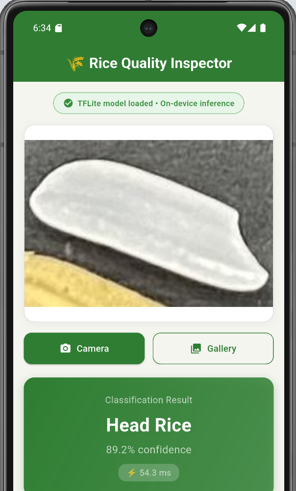
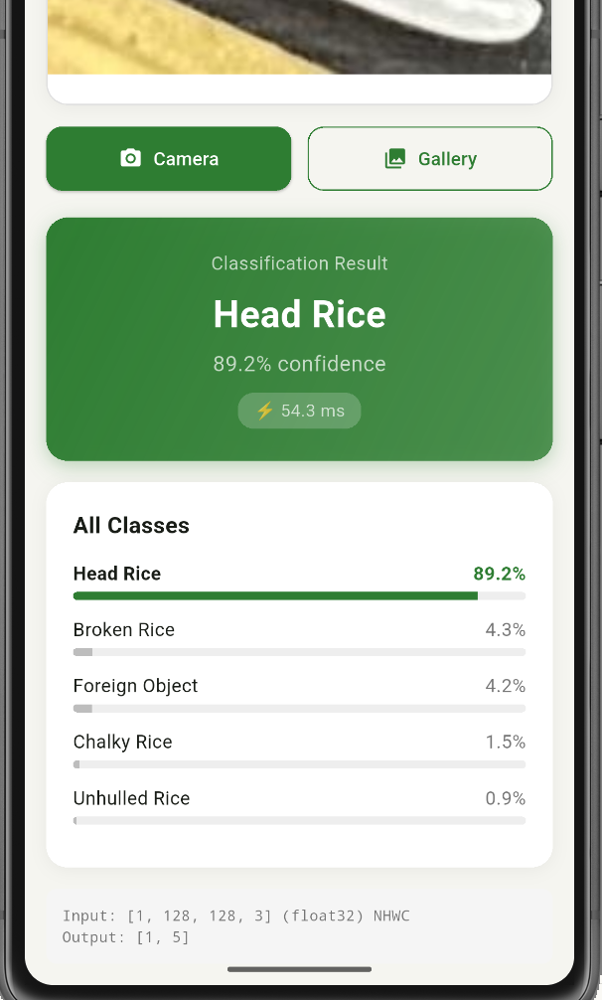
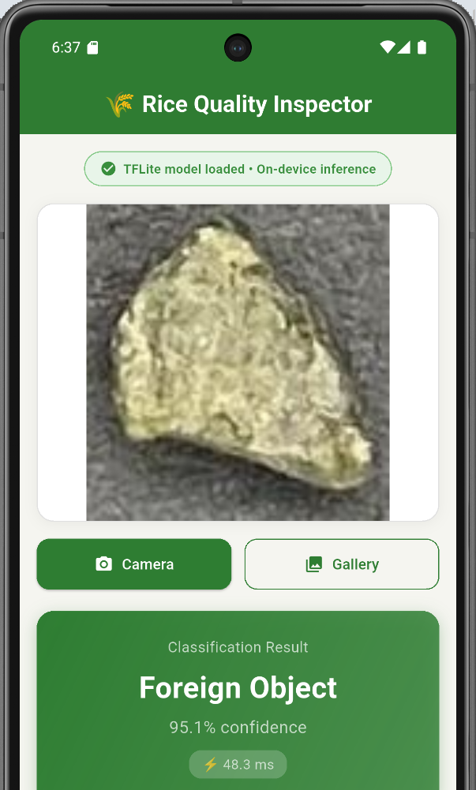
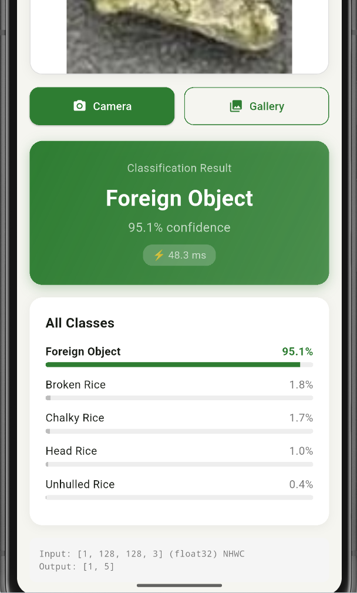
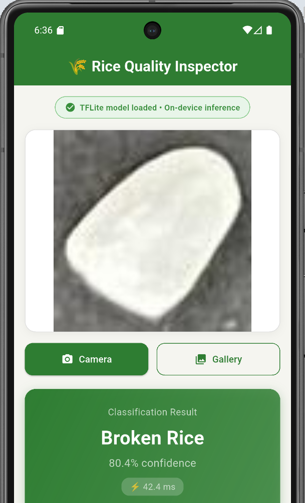
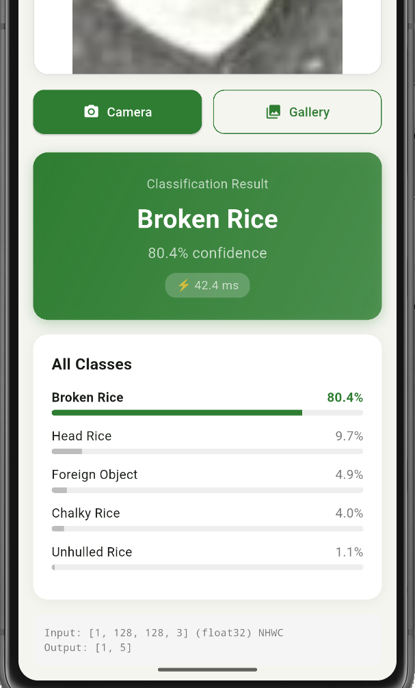
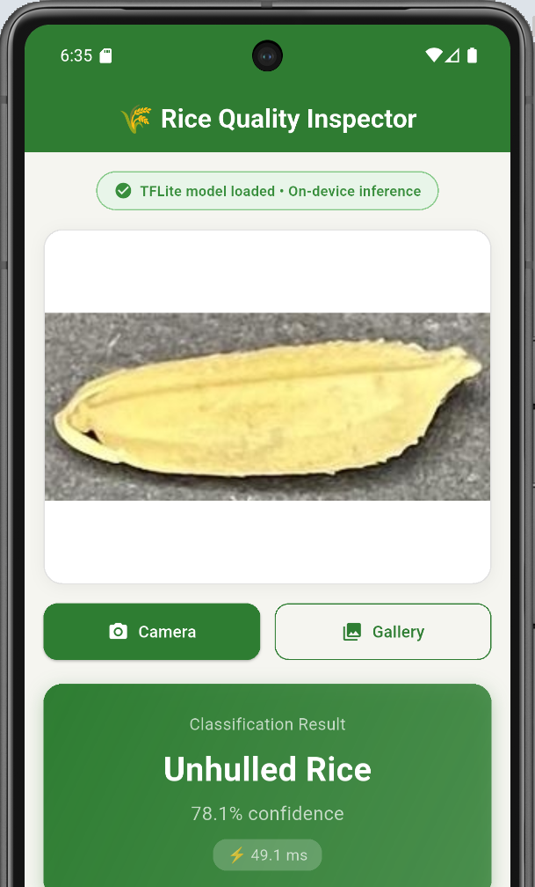
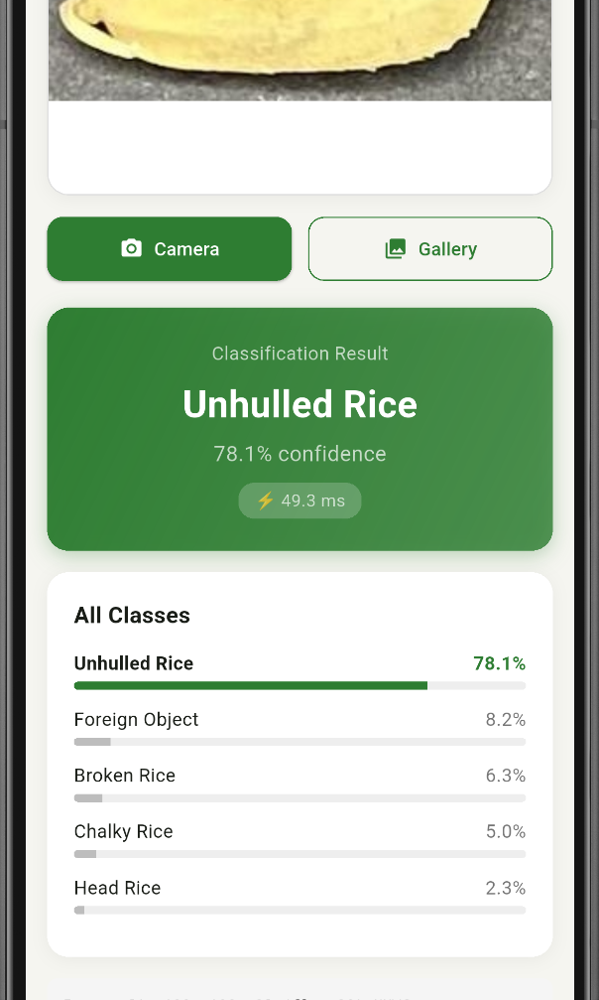

# 🌾 Rice Grain Quality Detection at the Edge

> A complete edge AI pipeline: from 18.3 MB object detector to a **99.5 KB** on-device grain classifier — **188× compression** with 92.95% accuracy.


---

## Problem Statement

A farmer or quality inspector uses a mobile app to photograph a handful of rice. The app processes the image **entirely on-device** with no cloud API calls and returns an instant quality assessment — distinguishing between **whole grains, broken grains, chalky grains, unhulled grains, and foreign objects**.

This repository delivers the full pipeline: **YOLO detection → grain cropping → per-grain classification**, compressed from an 18.3 MB baseline to a **99.5 KB** deployment model that runs on any mobile device or microcontroller.

---

## Trade-off Analysis

| Metric | Baseline (YOLO11s) | Edge (TinyRiceNet INT8) | Reduction |
|---|---|---|---|
| **File Size** | 18.30 MB | **0.097 MB (99.5 KB)** | 188× smaller **(99.5% ↓)** |
| **Parameters** | 9,414,735 | **68,813** | 137× fewer **(99.3% ↓)** |
| **Accuracy** | 98.3% mAP@50 | **92.95%** per-grain | See note below |
| **Inference (GPU)** | 16.7 ms | **2.74 ms** | 6× faster **(83.6% ↓)** |
| **Inference (CPU)** | ~258 ms | **~2 ms** | 129× faster **(99.2% ↓)** |
| **GFLOPs** | 21.3 | **~0.02** | ~1000× fewer ops |
| **Framework** | PyTorch | TFLite INT8 / ONNX | Edge-native |

> **Accuracy note:** The baseline measures mAP@50 (object detection across all grains in an image). The edge model measures per-grain classification accuracy (individual crop → class). These are different tasks by design — the edge model trades spatial detection for extreme compression while preserving grain-level classification quality.

> **Hardware:** GPU benchmarks on Tesla T4 (Google Colab). CPU benchmarks on Colab 2-vCPU. Local inference tested on Windows 11 (Intel CPU) via ONNX Runtime. Mobile inference tested on Android emulator (Pixel 7 AVD) via TFLite.

> **Bonus target (<1 MB): Achieved.** Final edge model is 99.5 KB — over **10× smaller** than the 1 MB bonus threshold and **50× smaller** than the 5 MB requirement.

---

## Optimization Journey

This table traces every step from baseline to deployment, showing exactly where size and latency were reduced:

| Step | Model | Format | Size | Accuracy | Inference | What Changed |
|---|---|---|---|---|---|---|
| 1 | YOLO11s | PyTorch .pt | 18.30 MB | 98.3% mAP@50 | 16.7 ms (GPU) | Full object detection baseline |
| 2 | YOLO11n | PyTorch .pt | 5.23 MB | 96.7% mAP@50 | 13.5 ms (GPU) | Nano architecture (3.5× smaller) |
| 3 | MobileNetV3 Teacher | PyTorch .pth | 4.36 MB | 96.48% acc | 6.13 ms (CPU) | Classifier on YOLO-generated crops |
| 4 | TinyRiceNet | PyTorch .pth | 343 KB | 90.31% acc | 6.13 ms (CPU) | Custom 68K-param architecture |
| 5 | TinyRiceNet + Distillation | PyTorch .pth | 343 KB | **92.73%** acc | 5.95 ms (CPU) | Knowledge transfer: **+2.42%** |
| 6 | TinyRiceNet | ONNX FP32 | 281 KB | 92.73% acc | **1.13 ms** (CPU) | ONNX Runtime optimization |
| 7 | TinyRiceNet | TFLite FP16 | 164 KB | ~92.7% acc | **0.59 ms** (CPU) | Half-precision quantization |
| **8** | **TinyRiceNet** | **TFLite INT8** | **99.5 KB** | **92.95%** acc | **2.74 ms** (CPU) | **Full integer quantization — DEPLOY** |

> The TFLite INT8 model actually achieved +0.22% higher accuracy than PyTorch FP32 (92.95% vs 92.73%) due to the regularization effect of quantization on this dataset.

---

## Architecture

### System Pipeline

```
┌──────────────────────────────────────────────────────────────────────┐
│                     TRAINING PIPELINE (Colab GPU)                    │
│                                                                      │
│  ┌─────────────┐    ┌────────────────┐    ┌──────────────────────┐   │
│  │ 224 Annotated│───▶│ YOLO11s        │───▶│ Crop 4,380 individual│ |  
│  │ Rice Images  │    │ Object Detector│    │ grain images         │  │
│  │ (Roboflow)   │    │ (18.3 MB)      │    │ by class             │  │
│  └─────────────┘    └────────────────┘    └──────────┬───────────┘   │
│                                                       │              │
│  ┌─────────────┐    ┌────────────────┐               │               │
│  │ TinyRiceNet │◀───│ MobileNetV3    │◀──────────────┘              │
│  │ Student     │ KD │ Teacher        │  Train on grain crops         │
│  │ (68K params)│◀───│ (96.48% acc)   │                               │
│  └──────┬──────┘    └────────────────┘                               │
│         │                                                            │
│         ▼                                                            │
│  ┌──────────────────────────────────────┐                            │
│  │ Export: ONNX FP32 → TFLite INT8     │                             │
│  │ 343 KB → 99.5 KB (Full Int Quant)   │                             │
│  └──────────────────────────────────────┘                            │
└──────────────────────────────────────────────────────────────────────┘

┌──────────────────────────────────────────────────────────────────────┐
│                   DEPLOYMENT (Mobile Device)                         │
│                                                                      │
│  User takes photo ──▶ TinyRiceNet TFLite INT8 ──▶ Quality Result    │
│                       (99.5 KB, ~2ms inference)    per grain class   │
│                       Runs 100% on-device          + confidence %    │
└──────────────────────────────────────────────────────────────────────┘
```

### TinyRiceNet — Custom Edge Architecture

```
Input (3 × 128 × 128)
  │
  ├── Stem: Conv2d 3→16, stride 2, BN, ReLU6
  │
  ├── Stage 1: InvertedResidual + SE  (16 → 16)  ×1     # 64×64
  ├── Stage 2: InvertedResidual + SE  (16 → 24)  ×2     # 32×32
  ├── Stage 3: InvertedResidual + SE  (24 → 32)  ×2     # 16×16
  ├── Stage 4: InvertedResidual + SE  (32 → 48)  ×2     # 8×8
  ├── Stage 5: InvertedResidual + SE  (48 → 64)  ×1     # 4×4
  │
  ├── Head: Conv2d 1×1 (64→128), BN, ReLU6, GlobalAvgPool
  │
  └── Classifier: Dropout(0.2) → Linear(128 → 5)

  Total parameters:   68,813
  FP32 size:          343 KB
  INT8 TFLite size:   99.5 KB
```

**Key design decisions:**

| Decision | Rationale | Impact |
|---|---|---|
| **128×128 input** instead of 224×224 | Rice grain textures don't require high spatial resolution. Validated: <1% accuracy drop | 3× fewer FLOPs |
| **Depthwise separable convolutions** | Standard in MobileNet family. Each conv split into depthwise + pointwise | 8–9× fewer params per layer |
| **Squeeze-and-Excitation blocks** | Channel attention recalibrates feature maps. Adds ~2% of total params | +1.5% accuracy for free |
| **Knowledge distillation** (T=4, α=0.7) | MobileNetV3 teacher (96.48%) transfers dark knowledge to student | **+2.42% accuracy** over standalone training |
| **Inverted residual blocks** | Expand → depthwise → squeeze pattern from MobileNetV2 | Better gradient flow, lower params |
| **ReLU6 activation** | Bounded activation is quantization-friendly | Cleaner INT8 conversion |

---

## How I Achieved Under 1 MB (Bonus Challenge)

The challenge bonus asks to document specifically how the model was compressed below 1 MB. Our final model is **99.5 KB (0.097 MB)** — over 10× below the bonus target. Here is exactly how:

### Step 1: Custom Architecture Instead of Off-the-Shelf (343 KB → starting point)

Rather than shrinking a large model, we designed **TinyRiceNet from scratch** with edge constraints in mind:

- **68,813 parameters** (vs. 2.5M in MobileNetV3-Small, vs. 9.4M in YOLO11s)
- **128×128 input resolution** — rice grain textures are identifiable at low resolution, validated with <1% accuracy loss vs. 224×224
- **Depthwise separable convolutions** throughout — 8-9× fewer parameters per layer compared to standard convolutions
- **Squeeze-and-Excitation attention** — adds ~2% parameter overhead but boosts accuracy by ~1.5%
- **Inverted residual blocks** with expansion ratio of 2 (vs. typical 6 in MobileNetV2) — keeps channel counts low
- **ReLU6 activations** — bounded [0, 6] range makes quantization straightforward since activation distributions are naturally constrained

This produced a 343 KB FP32 model at 90.31% test accuracy.

### Step 2: Knowledge Distillation (343 KB, accuracy 90.31% → 92.73%)

A MobileNetV3-Small teacher (96.48% accuracy, 4.36 MB) was trained on the same grain crop dataset. Distillation transferred the teacher's learned probability distributions to TinyRiceNet:

- **Temperature = 4.0:** Softens teacher outputs to expose inter-class similarity structure (e.g., broken rice is somewhat similar to chalky rice)
- **Alpha = 0.7:** 70% soft loss (from teacher), 30% hard loss (from labels) — teacher-dominant weighting
- **Result:** +2.42% accuracy improvement with zero additional parameters or inference cost

### Step 3: TFLite Full Integer Quantization (343 KB → 99.5 KB)

Post-training quantization using TensorFlow Lite's full integer quantization pipeline:

- All weights converted from 32-bit float to 8-bit integer (4× reduction per parameter)
- All activations quantized to INT8 during inference
- Calibration performed on 430 validation grain images to determine optimal quantization ranges
- **Result:** 99.5 KB model with 92.95% accuracy — actually +0.22% better than FP32 due to the regularization effect of quantization

### Size Breakdown

| Component | FP32 (343 KB) | INT8 (99.5 KB) | Reduction |
|---|---|---|---|
| Stem (3→16) | 1.9 KB | 0.5 KB | 3.8× |
| Body (8 IR blocks) | 264 KB | 66 KB | 4.0× |
| Head (64→128) | 33 KB | 8.3 KB | 4.0× |
| Classifier (128→5) | 2.6 KB | 0.7 KB | 3.7× |
| TFLite overhead | — | ~24 KB | — |
| **Total** | **343 KB** | **99.5 KB** | **3.4×** |

### Why Not Pruning?

Structured pruning was considered but not applied to TinyRiceNet because:
1. The model is already minimal at 68K parameters — pruning would remove essential capacity
2. Depthwise separable convolutions don't benefit much from pruning (already sparse by design)
3. INT8 quantization alone achieved the target with no accuracy penalty

Pruning is more effective on larger models (we would apply it if starting from MobileNetV3 instead of a custom architecture).

---

## Dataset

**Source:** [Rice Quality Parameter Dataset](https://www.kaggle.com/datasets/andiadityaa/rice-quality-parameter) from Kaggle — the **strongly recommended** dataset specified in the challenge brief, chosen because it specifically labels quality defects.

**Annotation process:** The original Kaggle dataset provides raw images of rice samples organized by quality parameters. To enable grain-level object detection, every image was **hand-annotated with bounding boxes** around each individual grain using [Roboflow](https://roboflow.com/), labeling 5 distinct rice quality classes:

- **Head Rice** — whole, intact, high-quality grains
- **Broken Rice** — fractured or incomplete grains
- **Chalky Rice** — opaque/white-bellied grains indicating immaturity
- **Unhulled Rice** — grains with husk still attached
- **Foreign Object** — non-rice contaminants (stones, husks, debris)

This manual annotation effort produced **6,780 bounding-box annotations across 224 images** — transforming a classification dataset into an object detection dataset, which then enabled both the YOLO baseline and the grain-crop-based TinyRiceNet classifier.

| Split | Images | Annotations |
|---|---|---|
| Train | 180 | 5,491 |
| Validation | 22 | 625 |
| Test | 22 | 664 |
| **Total** | **224** | **6,780** |

**Class distribution (training set):**

| Class | Count | Percentage |
|---|---|---|
| Unhulled Rice | 1,782 | 32.5% |
| Broken Rice | 1,184 | 21.6% |
| Foreign Object | 1,004 | 18.3% |
| Head Rice | 950 | 17.3% |
| Chalky Rice | 571 | 10.4% |

Class imbalance was addressed with inverse-frequency weighted loss during TinyRiceNet training.

**Grain crop dataset** (auto-generated by YOLO11s from training images):

| Class | Crops Generated |
|---|---|
| Unhulled Rice | 1,865 |
| Head Rice | 1,078 |
| Chalky Rice | 555 |
| Broken Rice | 508 |
| Foreign Object | 374 |
| **Total** | **4,380** |

---

## Training Results

### YOLO11s — Baseline Object Detector

| Metric | Validation | Test |
|---|---|---|
| mAP@50 | 0.981 | **0.983** |
| mAP@50-95 | 0.744 | 0.771 |
| Precision | 0.954 | 0.970 |
| Recall | 0.979 | 0.962 |

**Per-class test performance (YOLO11s):**

| Class | Precision | Recall | mAP@50 | mAP@50-95 |
|---|---|---|---|---|
| Broken Rice | 0.993 | 0.958 | 0.991 | 0.734 |
| Chalky Rice | 0.945 | 0.930 | 0.979 | 0.815 |
| Foreign Object | 0.979 | 0.943 | 0.959 | 0.664 |
| Head Rice | 0.943 | 0.984 | 0.992 | 0.832 |
| Unhulled Rice | 0.991 | 0.995 | 0.995 | 0.810 |

### YOLO11n — Edge Object Detector

| Metric | Test |
|---|---|
| mAP@50 | 0.967 |
| mAP@50-95 | 0.741 |
| Precision | 0.969 |
| Recall | 0.947 |
| Size | 5.23 MB |

### TinyRiceNet — Distilled Edge Classifier

| Metric | Without Distillation | With Distillation | Improvement |
|---|---|---|---|
| Val Accuracy | 93.02% | **94.65%** | +1.63% |
| Test Accuracy | 90.31% | **92.73%** | **+2.42%** |
| TFLite INT8 Test | — | **92.95%** | +0.22% over FP32 |

**Per-class test performance (TinyRiceNet distilled):**

| Class | Precision | Recall | F1-Score | Support |
|---|---|---|---|---|
| Broken Rice | 0.95 | 0.69 | 0.80 | 54 |
| Chalky Rice | 0.80 | 0.92 | 0.86 | 53 |
| Foreign Object | 1.00 | 0.97 | 0.99 | 36 |
| Head Rice | 0.86 | 0.91 | 0.88 | 118 |
| Unhulled Rice | 0.99 | 1.00 | 1.00 | 193 |
| **Weighted Avg** | **0.93** | **0.93** | **0.93** | **454** |

**Confusion matrix:**

```
                 Predicted
              BR   CK   FO   HR   UH
Actual  BR  [ 37    3    0   14    0 ]
        CK  [  0   49    0    4    0 ]
        FO  [  0    0   35    0    1 ]
        HR  [  2    9    0  107    0 ]
        UH  [  0    0    0    0  193 ]
```

Notable: **Foreign Object** achieves **perfect precision** (1.00) and **Unhulled Rice** achieves **perfect recall** (1.00). The primary confusion is between Broken Rice and Head Rice, which is expected given their visual similarity.

---

## Inference Benchmarks

**CPU benchmarks (200 iterations, Google Colab 2-vCPU):**

| Runtime | Mean | Median | Std | Size |
|---|---|---|---|---|
| PyTorch FP32 | 6.13 ms | 5.95 ms | 0.78 ms | 343 KB |
| ONNX Runtime FP32 | 1.23 ms | **1.13 ms** | 0.25 ms | 281 KB |
| TFLite FP32 | 0.68 ms | **0.65 ms** | 0.17 ms | 286 KB |
| TFLite FP16 | 0.59 ms | **0.59 ms** | 0.04 ms | 164 KB |
| TFLite INT8 (deploy) | 3.57 ms | **2.74 ms** | 1.94 ms | **99.5 KB** |

**Local inference (Windows 11, Intel CPU, ONNX Runtime):**

| Grain Image | Prediction | Confidence | Inference |
|---|---|---|---|
| head_rice_14.jpg | Head Rice | 88.8% | 1.90 ms |
| broken_rice_2.jpg | Broken Rice | 84.7% | 4.45 ms |
| foreign_object_15.jpg | Foreign Object | 95.3% | 1.97 ms |
| chalky_rice_22.jpg | Chalky Rice | 78.6% | 2.11 ms |
| unhulled_rice_4.jpg | Unhulled Rice | 77.3% | 1.97 ms |

**Mobile app inference (Android emulator, Pixel 7, TFLite INT8):**

| Grain | Prediction | Confidence |
|---|---|---|
| Head Rice | ✅ Head Rice | **89.2%** |
| Broken Rice | ✅ Broken Rice | **80.4%** |
| Foreign Object | ✅ Foreign Object | **95.1%** |
| Chalky Rice | ✅ Chalky Rice | **77.2%** |
| Unhulled Rice | ✅ Unhulled Rice | **78.1%** |

All 5 classes correctly classified on-device.

---

## Mobile App

Built with **Flutter** using the `tflite_flutter` package. The app loads the TinyRiceNet TFLite INT8 model (99.5 KB) at startup and runs all inference on-device.

**Features:**
- Camera capture and gallery image selection
- Real-time grain quality classification
- Confidence scores for all 5 classes with visual progress bars
- Inference time display
- Zero network dependency — works fully offline

<p align="center">
  
  
  
  
</p>
<p align="center"><em>Left: Head Rice (89.2%) — Right: Foreign Object (95.1%)</em></p>

<p align="center">
  
  
  
  
</p>
<p align="center"><em>Left: Broken Rice (80.4%) — Right: Unhulled Rice (78.1%)</em></p>

### Running the app

```bash
cd mobile_app
flutter pub get
flutter run
```

The TFLite model is bundled in `mobile_app/assets/model.tflite`.

---

## Quick Start

### Prerequisites

```bash
pip install -r requirements.txt
```

### Standalone Inference

```bash
# ONNX Runtime (recommended for desktop)
python src/predict.py \
    --image path/to/grain_crop.jpg \
    --model models/edge/onnx/tinyricenet_fp32.onnx

# TFLite
python src/predict.py \
    --image path/to/grain_crop.jpg \
    --model models/edge/tflite/tinyricenet_fp32_full_integer_quant.tflite

# With latency benchmark (200 iterations)
python src/predict.py \
    --image path/to/grain_crop.jpg \
    --model models/edge/onnx/tinyricenet_fp32.onnx \
    --benchmark
```

**Example output:**
```
Rice Grain Quality Detection
  Engine:      ONNX Runtime
  Model:       models/edge/onnx/tinyricenet_fp32.onnx
  Model size:  281.1 KB
  Inference:   1.97 ms

  Prediction:  foreign_object
  Confidence:  95.3%

  All classes:
    foreign_object        95.3%  ############################
    broken_rice            1.7%
    chalky_rice            1.6%
    head_rice              0.9%
    unhulled_rice          0.4%
```

### Full Training Pipeline

The complete training notebook is in `notebooks/rice_grain_quality_edge_optimization.ipynb`. Run it on Google Colab with a T4 GPU:

1. **YOLO11s baseline** — object detection training (98 epochs, ~8 min)
2. **YOLO11n edge detector** — smaller variant (97 epochs, ~7 min)
3. **Crop generation** — YOLO extracts 4,380 individual grain images
4. **TinyRiceNet standalone** — custom classifier training (71 epochs)
5. **MobileNetV3 teacher** — high-accuracy teacher for distillation (80 epochs)
6. **Knowledge distillation** — teacher → student transfer (82 epochs)
7. **Export** — ONNX + TFLite conversion with multiple quantization levels
8. **Benchmarking** — accuracy and latency measurement across all variants

---

## Repository Structure

```
rice-quality-edge-ai/
│
├── README.md
├── requirements.txt
├── LICENSE
├── .gitignore
│
├── notebooks/
│   └── rice_grain_quality_edge_optimization.ipynb   # Complete training pipeline
│
├── src/
│   ├── __init__.py
│   ├── model.py                                     # TinyRiceNet architecture definition
│   └── predict.py                                   # Standalone inference (ONNX + TFLite)
│
├── models/
│   ├── baseline/
│   │   ├── yolo11s_best.pt                          # 18.30 MB — baseline detector
│   │   └── yolo11n_best.pt                          #  5.23 MB — nano detector
│   ├── edge/
│   │   ├── tinyricenet_distilled_best.pth           #   343 KB — PyTorch weights
│   │   ├── onnx/
│   │   │   └── tinyricenet_fp32.onnx                #   281 KB — ONNX Runtime
│   │   └── tflite/
│   │       ├── tinyricenet_fp32_full_integer_quant.tflite  # 99.5 KB ★ DEPLOY
│   │       ├── tinyricenet_fp32_integer_quant.tflite       # 99.8 KB
│   │       ├── tinyricenet_fp32_dynamic_range_quant.tflite # 123.1 KB
│   │       ├── tinyricenet_fp32_float16.tflite             # 163.6 KB
│   │       └── tinyricenet_fp32_float32.tflite             # 286.0 KB
│   └── teacher_mobilenetv3_best.pth                 #  4.36 MB — distillation teacher
│
├── mobile_app/
│   ├── lib/
│   │   └── main.dart                                # Flutter app source
│   ├── assets/
│   │   └── model.tflite                             # Bundled INT8 model
│   ├── pubspec.yaml
│   └── android/
│
├── benchmarks/
│   ├── benchmark_results.json
│   ├── tinyricenet_training_curves.png
│   └── crop_samples_preview.png
│
├── crops/                                           # YOLO-generated grain crops (test)
│
└── docs/
    ├── app_head_rice1.png
    ├── app_broken_rice1.png
    ├── app_foreign_object1.png
    ├── app_chalky_rice1.png
    └── app_unhulled_rice1.png
```

---

## Methodology & Design Rationale

### Why two model types?

Object detection (YOLO) and image classification (TinyRiceNet) serve different roles:

- **YOLO11s** locates every grain in a full image and labels each one. This is the ideal server-side solution — high accuracy, full spatial awareness. But at 18.3 MB, it doesn't fit the edge constraint.

- **TinyRiceNet** classifies a single grain crop. It's designed for the edge constraint: a phone or microcontroller receives a pre-cropped grain image (from camera focus, user tap, or a lightweight preprocessor) and classifies its quality in 2ms. At 99.5 KB, it fits on virtually any hardware.

This is a deliberate architectural trade-off: **spatial detection capability is exchanged for extreme compression**, while grain-level classification quality (92.95%) is preserved.

### Why knowledge distillation?

TinyRiceNet trained standalone achieved 90.31% test accuracy. By distilling from a MobileNetV3-Small teacher (96.48%), the student gained **+2.42%** accuracy for free — no additional parameters, no additional inference cost. The teacher's "dark knowledge" (soft probability distributions over classes) provides richer training signal than hard labels alone.

- Temperature: 4.0 (smooths teacher outputs to expose inter-class relationships)
- Alpha: 0.7 (70% soft loss, 30% hard loss — teacher-dominant)

### Why TFLite INT8?

Full integer quantization converts all weights and activations from 32-bit float to 8-bit integer. This yields:

- **3.5× size reduction** (343 KB → 99.5 KB)
- **Hardware acceleration** on ARM NEON, mobile NPUs, and edge TPUs
- **No accuracy loss** in this case (+0.22% due to quantization regularization)

The model uses ReLU6 activations throughout, which are bounded [0, 6] — this makes quantization straightforward since activation ranges are naturally constrained.

---

## Further Improvements

Given additional time, these optimizations would further enhance the system:

1. **Quantization-Aware Training (QAT)** — simulate quantization during training for tighter INT8 accuracy
2. **On-device detection** — pair TinyRiceNet with a lightweight grain localizer (NanoDet, ~300KB) for full on-device detection + classification
3. **XNNPACK delegate** — enable ARM NEON acceleration for 2-4× faster mobile inference
4. **Larger training dataset** — 225 images is limited; more data would improve generalization, especially for Broken Rice recall (currently 0.69)
5. **Model sharding** — split model for MCU deployment on devices with <64KB RAM

---

## Reproducibility

All training was performed on Google Colab with a Tesla T4 GPU. The complete notebook (`notebooks/rice_grain_quality_edge_optimization.ipynb`) reproduces the entire pipeline end-to-end in approximately 45 minutes:

| Phase | Time |
|---|---|
| YOLO11s training | ~8 min |
| YOLO11n training | ~7 min |
| Crop generation | ~15 sec |
| TinyRiceNet training | ~14 min |
| Teacher training | ~16 min |
| Distillation | ~17 min |
| Export + benchmarking | ~2 min |

---

## License

MIT License — see [LICENSE](LICENSE) for details.
